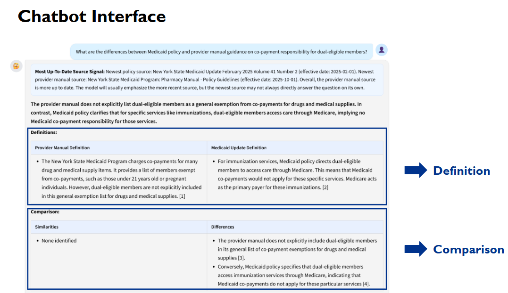
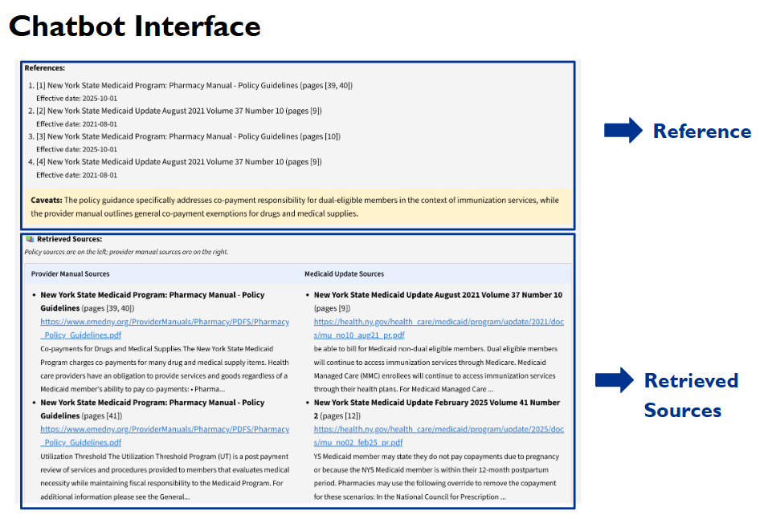
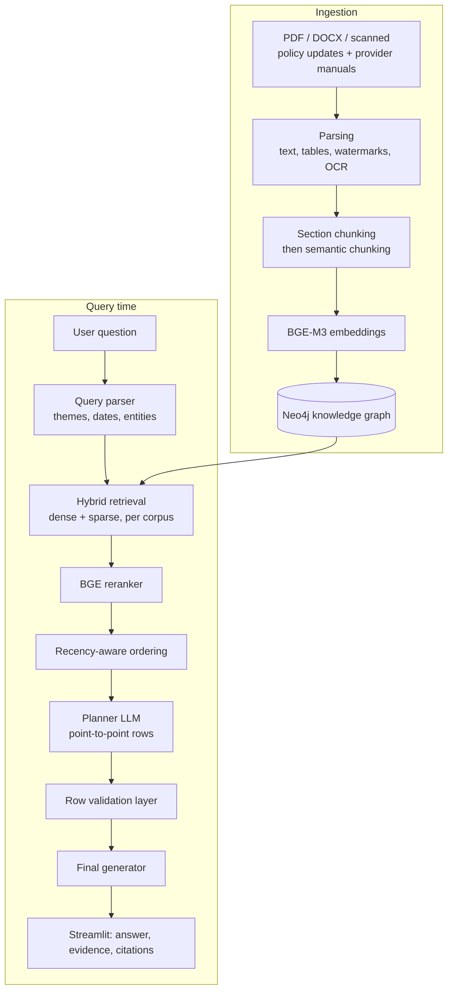

# Healthcare Policy & Manual RAG System

A retrieval-augmented question-answering system over New York State Medicaid policy
updates and provider manuals, built as a Columbia University MSDS capstone in partnership
with KPMG. The project was scoped and mentored by KPMG's data science lead, who reviewed
our approach in weekly meetings, and the final system and evaluation results were
presented to KPMG stakeholders.

NYS Medicaid policy is public, but answering one question is still slow: the rules live
across policy updates and provider manuals that are long, versioned, and issued by
different authorities, and an analyst has no easy way to check whether an answer they
were given is still current. We inherited a baseline single-question Q&A pipeline from a
previous capstone team and found two gaps in it:

1. **No comparison.** The baseline answered one question at a time, with no way to put
   policy and provider-manual guidance side by side on the same topic.
2. **Wording match, not meaning match.** Retrieval matched the phrasing of the question,
   so a question in plain English missed rules written in regulatory language.

This project closes both: a **Compare mode** that aligns the two corpora point by point,
**meaning-aware hybrid retrieval**, and **per-claim recency and citations** so every
sentence links back to a source document, page, and effective date.

## Interface

**Compare mode** — one question, aligned definitions from both corpora, and an explicit
similarities/differences breakdown. The banner at the top reports which source is more
recent, so a reader knows which rule currently governs.



**Every claim is traceable** — numbered references carry document, page, and effective
date; retrieved sources are shown side by side with direct links to the source PDFs, so
a claim can be verified in seconds rather than taken on trust.



The system also refuses out-of-scope questions rather than answering them from parametric
knowledge.

## Results

Evaluated with an LLM-as-judge framework over ground-truth answers written by KPMG policy
professionals. The comparison track uses five metrics (query alignment, correctness,
completeness, accuracy, balance); the definition tracks use three (faithfulness,
relevance, correctness).

**720 test cases = 12 queries × 5 repetitions × 6 system branches × 2 LLM models.**
Repetitions and parallel branches make the comparison between configurations a controlled
one rather than a single-shot score.

| Track | Metrics | Score | Weight |
| --- | --- | --- | --- |
| Policy definition | Faithfulness, relevance, correctness | 79% | 15% |
| Provider manual definition | Faithfulness, relevance, correctness | 80% | 15% |
| Comparison | Query alignment, correctness, completeness, accuracy, balance | 81% | 70% |
| **Overall** | Weighted average | **81%** | — |

Best configuration: **dense + sparse retrieval, point-to-point comparison, Gemini 2.5 Flash.**

### Retrieval ablation

Six system branches, scored on the same cases:

| Branch | Median | Mean |
| --- | --- | --- |
| **dense_sparse_p2p** (final) | **0.837** | **0.829** |
| theme_aware_p2p | 0.823 | 0.807 |
| theme_aware | 0.821 | 0.808 |
| dense_sparse | 0.817 | 0.815 |
| llm_extract_p2p | 0.807 | 0.802 |
| llm_extract | 0.794 | 0.760 |

Two findings drove the final design:

- **Hybrid dense + sparse beats LLM-based extraction** by 4.3 points of median and 6.9
  points of mean. Dense-only retrieval confused semantically similar passages across
  policy and manual documents; adding sparse keyword search separated them.
- **Point-to-point comparison raises the median in every branch** and tightens the score
  distribution, mostly by removing low-score outliers — the failure mode it fixes is a
  comparison row that drifts across several topics at once.

### Model selection

Across 360 paired tests, Gemini 2.5 Flash beat GPT-5.4-mini on 222 and lost on 132. A
paired t-test was borderline (p = 0.054) while a Wilcoxon signed-rank test was clearly
significant (p < 0.001) — but the effect size was small (Cohen's dz = −0.10, mean
difference 0.0083). We reported the non-parametric test because the per-case score
differences were not symmetric, and treated the two models as practically interchangeable
rather than claiming a winner.

A separate grid over chunk size, reranking, and rerank weight (9 configurations × 3
models) found **1200-character chunks with reranking at α = 0.5** best: 85% overall with
GPT-5, against 83% for the no-rerank 1000-character baseline. 1500-character chunks were
worse (77–83%), and Llama 3.2 3B topped out at 48%.

<!-- TODO Boyang: confirm the labelling above — the 81% overall is the comparison-track
     evaluation, and the 85% is the definition/Q&A configuration search. Anyone reading
     both numbers will ask which is which, so make sure the framing matches what you
     presented to KPMG. -->

## Architecture



### Knowledge graph

Nodes follow **Authority → Document → Page → Chunk**, with `ISSUED`, `CONTAINS`,
`HAS_CHUNK`, `HAS_TABLE` and `HAS_OCR` relationships. Chunks carry `doc_class`, which
separates policy from provider-manual content, and documents carry `effective_date`.

This is what makes filtered retrieval a first-class operation: a query can be scoped to
one issuing authority, one document class, or one effective-date range *before* any
vector search runs. It also gives every answer a provenance path — "this chunk belongs to
page X of document Y, issued by authority Z, effective on date D" — which is what the
citation panel renders.

### Point-to-point comparison

The failure mode in naive comparison is a row that tries to compare several things at
once. The pipeline forces one topic per row:

- **Query parser** extracts themes, time constraints, and key entities, and passes a
  normalized query into retrieval and planning.
- **Planner LLM** breaks the question into concrete sub-questions and builds comparison
  rows by anchoring on provider-manual evidence, then matching the best policy chunk.
- **Row validation layer** checks each row stays on one comparison point, verifies it is
  supported by retrieved evidence, and flags missing, weak, or conflicting support before
  generation.
- **Final generator** writes only from the approved row plan and cannot invent new rows.


## Tech stack

Python · Neo4j · BGE-M3 embeddings · BGE reranker · Gemini 2.5 Flash / GPT-5 · PyTorch ·
Tesseract OCR · LibreOffice · Streamlit · Docker

## Limitations and next steps

- **Cross-source matching** still mismatches occasionally when the two corpora frame a
  topic differently.
- **Version awareness** surfaces effective dates but does not yet state plainly whether a
  rule has been superseded.
- **Comparison quality checks** flag weak rows but a human still reviews unclear
  comparisons before release.
- Not yet deployed in a KPMG- or NYS-managed environment, and not yet evaluated by end
  users in their own workflow.

---

## Project Organization

```
Columbia_Capstone-KPMG/
│── configs/                 
│   └── ingest_parse.yaml       # Config files (parameters for pipelines)
│
│── data/                      
│   ├── raw/                    # Raw input documents (NEVER commit to git)
│   ├── processed/              # Outputs generated by parsing/processing
│
│── docker/                      
│   ├── .env.example            # Template for env variables (Neo4j credentials and configs)
│   ├── docker-compose.yml      # Compose file to spin up Neo4j container
│
│── docs/                       # Notes, research findings, design docs
│
│── scripts/                    # CLI entry scripts (team runs these)
│   └── do_asterisk_chunking.py
│   └── do_fix_size_chunking.py
│   └── do_semantic_chunking.py
│   ├── doc_converter.py
│   └── ingest_graph.py
│   └── ingestion_parse.py
│   └── reset_graph.py
│   └── test_neo4j.py
│
│── src/                        # Core source code (modularized)
│   ├── doc_2_docx/             # Conversion logic (.doc → .docx; Windows-dependent)
│   │   └── ...
│   │
│   ├── healthcare_rag_llm/     # Main package
│   │   ├── doc_parsing/        # Parsing PDF/Docx (tables, watermarks, images)
│   │   │   └── ...
│   │   │
│   │   ├── chunking/           # Text splitting strategies
│   │   │   └── ...
│   │   │
│   │   ├── embedding/          # Embedding models
│   │   │   └── ...
│   │   │
│   │   ├── graph_builder/      # Knowledge Graph builder (refer to README.md for usage note)
│   │   │   └── ...
│   │   │
│   │   ├── pipelines/          # Orchestrated workflows (end-to-end)
│   │   │   └── ...
│   │   │
│   │   ├── utils/              # Helper functions (I/O, logging, common tools)
│   │   │   └── ...
│   │   │
│   │   └── ...                 # Placeholder for future modules
│   │
│   └── __init__.py             # Makes src a Python package
│
│── .gitignore                  # Ignores data/, .venv/, logs, etc.
│── pyproject.toml              # Dependency config
│── README.md                   # (this file)
```

## Data Handling

* Put **all raw Medicaid PDFs/Docs** under:

  * **macOS/Linux**:

    ```
    data/raw/Childrens Evolution of Care/
    ```
  * **Windows**:

    ```
    data\raw\Childrens Evolution of Care\
    ```

* Parsed outputs go to:

  * **macOS/Linux**:

    ```
    data/processed/
    ```
  * **Windows**:

    ```
    data\processed\
    ```

* **DO NOT** commit files under `data/` (git will ignore them).
* If you need to share data: use Google Drive/SharePoint.

## System Requirements

### Python Version
- **Required**: Python 3.9 - 3.12
- **Recommended**: Python 3.11
- **Not supported**: Python 3.13+ (PyTorch compatibility)

### Hardware

#### GPU (Highly Recommended for Performance)
- **Supported**: NVIDIA GPUs (GTX 10 series and newer)
  - Examples: RTX 4090, RTX 3080, RTX 2070, GTX 1660
- **Performance**: 10-20x faster than CPU
- **Unsupported GPUs**: Automatically fall back to CPU

#### CPU Only (Works but Slower)
- Any modern multi-core processor
- 8GB+ RAM recommended
- Expect longer processing times

**Performance Comparison**:
- GPU (RTX 2070): ~35 seconds for 5000 chunks
- CPU (Ryzen 7): ~250-500 seconds for 5000 chunks

📖 **See [INSTALLATION.md](INSTALLATION.md) for detailed requirements and setup instructions.**

## Git Workflow (Team Rules)

1. **Create a branch for each feature/task**

   ```
   git checkout -b feature/<short-description>
   ```

   Examples:

   * `feature/update-doc-parsing`
   * `bugfix/ocr-path`

2. **Commit frequently, but small logical chunks**

   ```
   git add <files>
   git commit -m "Clear message: what & why"
   ```

3. **Sync with main before push**

   ```
   git checkout main
   git pull origin main
   git checkout feature/your-branch
   git merge main
   ```

4. **Push your branch**

   ```
   git push origin feature/your-branch
   ```

5. **Open a Pull Request (PR) on GitHub**

   * Always make a PR into `main`
   * Request at least 1 teammate as reviewer
   * Merge only after review

6. **Delete branch after merge**

   * On GitHub → “Delete branch”
   * Locally:

     ```
     git branch -d feature/your-branch
     ```

## Quickstart

1. Clone repo & create virtual environment:

* **macOS/Linux**

  ```bash
  git clone git@github.com:Zenpyhr/Columbia_Capstone-KPMG.git
  cd Columbia_Capstone-KPMG
  python3 -m venv .venv
  source .venv/bin/activate
  ```

* **Windows**

  ```powershell
  git clone git@github.com:Zenpyhr/Columbia_Capstone-KPMG.git
  cd Columbia_Capstone-KPMG
  python -m venv .venv
  .\.venv\Scripts\activate
  ```

2. Install PyTorch (GPU support recommended):

  ```bash
  # Universal installation (works on all systems)
  pip install torch torchvision torchaudio --index-url https://download.pytorch.org/whl/cu121

  # This automatically uses GPU if available, CPU otherwise
  ```

3. Install other dependencies:

  ```bash
  pip install -e .

  # Download NLTK data (required for semantic chunking)
  python -c "import nltk; nltk.download('punkt'); nltk.download('punkt_tab')"
  ```

4. Install system dependencies:

* **macOS**

  ```bash
  brew install tesseract libreoffice
  ```

* **Linux**

  ```bash
  sudo apt-get install tesseract-ocr libreoffice
  ```

* **Windows**

  * [Tesseract OCR](https://github.com/UB-Mannheim/tesseract/wiki)
  * Microsoft Word (via COM) **or** LibreOffice

5. Verify installation:

  ```bash
  python -c "import torch; print(f'Device: {\"GPU - \" + torch.cuda.get_device_name(0) if torch.cuda.is_available() else \"CPU\"}')"
  ```

6. Put sample documents under `data/raw/...`

7. Sample run:

* **macOS/Linux**

  ```bash
  python scripts/ingestion_parse.py --config configs/ingest_parse.yaml
  ```

* **Windows**

  ```powershell
  python scripts\ingestion_parse.py --config configs\ingest_parse.yaml
  ```

